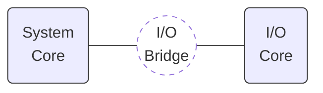

There are many designs of small 8-bit computers on the web that are based around a single pcb or compact design. While a single self contained board looks really cool and trendy, I don't think it gives you the flexibility to upgrade, change or expand the system when you want to try something new ideas or add extra functionality.

The goal of the Whizz80 is to allow the design to grow and expand as you develop it (it is iterative process as I learn, so mistakes would be made). Because of this I am deciding to use a modular approach and have divided up the computer into 2 distinct core modules. The [System Core](/design/system-core) and the [I/O Core](/design/io-core).

The 2 cores are connected to each other via an [I/O Bridge](/design/io-bridge). You can run the Whizz80 without the [I/O Core](/design/io-core) and [I/O Bridge](/design/io-bridge), but it wouldn't be a very exciting computer (and the only way to interface with it would be probing the Whizz80 bus with an external tool such as a logic probe, multimeter or oscilloscope).
